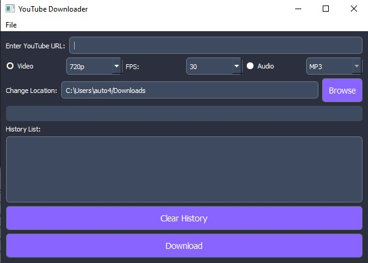

# Download-Youtube
A simple YouTube downloader built with Python and PyQt5 that allows you to download videos and audio from YouTube. This program supports various resolutions for video and formats for audio.

## Features
- Download YouTube videos and audio.
- Choose video quality: 720p, 1080p, 4K.
- Choose audio format: MP3, WAV.
- Save files to a custom folder location.
- View history of downloaded files.
- Option to download multiple URLs.

## Installation
### Requirements
Before using this application, you need to install the following dependencies:

- Python 3.x
- PyQt5
- yt-dlp (YouTube downloader)

### Installation Steps
1. Clone or download this repository to your local machine:
    ```bash
    git clone https://github.com/your-repository-url.git
    ```

2. Install the required dependencies:
    ```bash
    pip install -r requirements.txt
    ```

3. After installing dependencies, you can run the program:
    ```bash
    python main.py
    ```

## How to Use

1. **Enter YouTube URL**: Paste the YouTube video or playlist URL in the input box.
2. **Select Quality**: Choose the resolution for video download (720p, 1080p, or 4K). For audio, choose MP3 or WAV format.
3. **Choose Download Location**: You can change the download folder by clicking the "Browse" button.
4. **Start Download**: Click the "Download" button to begin downloading the selected content.
5. **View Download History**: The list of downloaded files will appear in the "History List" section. You can double-click on an item to open the downloaded file.

## Customization
You can adjust the download settings by changing the resolution or audio format options based on your needs. The program supports various YouTube video and audio formats, allowing you to choose the best quality available.

## Screenshots


## License
This project is licensed under the MIT License - see the [LICENSE](LICENSE) file for details.

---

# Download-Youtube
โปรแกรมดาวน์โหลด YouTube ที่สร้างด้วย Python และ PyQt5 ที่ช่วยให้คุณสามารถดาวน์โหลดวิดีโอและเสียงจาก YouTube ได้ โปรแกรมนี้รองรับคุณภาพวิดีโอหลายระดับและรูปแบบเสียงต่าง ๆ

## คุณสมบัติ
- ดาวน์โหลดวิดีโอและเสียงจาก YouTube
- เลือกคุณภาพวิดีโอ: 720p, 1080p, 4K
- เลือกรูปแบบเสียง: MP3, WAV
- บันทึกไฟล์ในโฟลเดอร์ที่กำหนดเอง
- ดูประวัติการดาวน์โหลด

## การติดตั้ง
### ข้อกำหนด
ก่อนที่จะใช้งานโปรแกรมนี้ คุณต้องติดตั้งไลบรารีดังนี้:

- Python 3.x
- PyQt5
- yt-dlp (YouTube downloader)

### ขั้นตอนการติดตั้ง
1. Clone หรือดาวน์โหลดโค้ดจาก GitHub มาเก็บไว้ในเครื่องของคุณ:
    ```bash
    git clone https://github.com/your-repository-url.git
    ```

2. ติดตั้งไลบรารีที่จำเป็น:
    ```bash
    pip install -r requirements.txt
    ```

3. หลังจากติดตั้งเสร็จแล้ว คุณสามารถรันโปรแกรมได้ด้วยคำสั่ง:
    ```bash
    python main.py
    ```

## วิธีการใช้งาน

1. **ใส่ URL ของ YouTube**: วางลิงก์ของวิดีโอหรือเพลย์ลิสต์ YouTube ที่ต้องการดาวน์โหลด
2. **เลือกคุณภาพ**: เลือกระดับความละเอียดสำหรับดาวน์โหลดวิดีโอ (720p, 1080p หรือ 4K) หรือเลือกรูปแบบเสียง (MP3 หรือ WAV)
3. **เลือกโฟลเดอร์สำหรับการดาวน์โหลด**: คุณสามารถเลือกโฟลเดอร์ที่ต้องการบันทึกไฟล์ได้โดยคลิกปุ่ม "Browse"
4. **เริ่มดาวน์โหลด**: คลิกปุ่ม "Download" เพื่อเริ่มการดาวน์โหลด
5. **ดูประวัติการดาวน์โหลด**: รายการไฟล์ที่ดาวน์โหลดจะปรากฏในส่วน "History List" คุณสามารถดับเบิลคลิกที่รายการเพื่อเปิดไฟล์

## การปรับแต่ง
คุณสามารถปรับแต่งการตั้งค่าการดาวน์โหลดได้โดยการเลือกความละเอียดหรือรูปแบบเสียงตามที่คุณต้องการ โปรแกรมรองรับหลายรูปแบบของวิดีโอและเสียงจาก YouTube เพื่อให้คุณสามารถเลือกคุณภาพที่ดีที่สุดที่มี

## สกรีนช็อต


## License
โปรเจคนี้เป็นโครงการที่ได้รับอนุญาตภายใต้ **MIT License** - ดูรายละเอียดได้ในไฟล์ [LICENSE](LICENSE)
